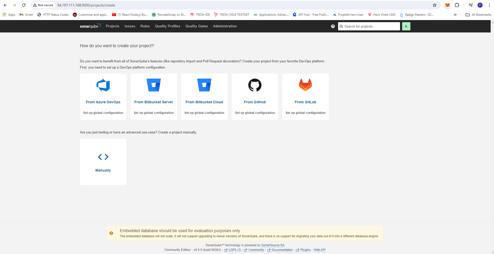

# Sparrow Coding Lab Project

## LMS Sparrow Coding Lab Architecture


## Setup Git Repository

1. LMS Compiler [git private repo] (https://github.com/surendergupta/lms-compiler.git)
2. LMS Backend [git private repo] (https://github.com/surendergupta/lms-backend.git)
3. LMS Frontend [git private repo] (https://github.com/surendergupta/lms-compiler.git)
4. LMS Landing UI [git private repo] (https://github.com/surendergupta/lms-landing-ui.git)
5. LMS Deployment Jenkins [git private repo] (https://github.com/surendergupta/lms-deployment-jenkins.git)

## Push Code Into GitHub Repository

- Push code in every repository

```bash
git status
git add .
git commit -m "Initial commit"
git push
```

## Create Jenkins Server to Continueus Integration ( CI ) and Continueus Deployment ( CD )

### Prerequisite

- Ubuntu AMI (ami-04b70fa74e45c3917)
- t3.large EC2 Machine (2 vCPU, 8GiB Memory)
- Key Pair (lms-jenkins-server)
- Storage 35 GiB gp3 (Root Volume)
- Allocate EIP (3.109.109.10)
- Associate EIP with jenkins server


## Setup Jenkins Server

1. SSH Login, Open Terminal and Type
    - chmod 400 "lms-jenkins-server-key.pem"
    - ssh -i "lms-jenkins-server-key.pem" ubuntu@54.197.111.168

2. Install Java openjdk-17-jre

```bash
sudo apt-get update
sudo apt install fontconfig openjdk-17-jre
java -version

```


3. Install Jenkins

```bash
sudo wget -O /usr/share/keyrings/jenkins-keyring.asc \
  https://pkg.jenkins.io/debian-stable/jenkins.io-2023.key
echo "deb [signed-by=/usr/share/keyrings/jenkins-keyring.asc]" \
  https://pkg.jenkins.io/debian-stable binary/ | sudo tee \
  /etc/apt/sources.list.d/jenkins.list > /dev/null
sudo apt-get update
sudo apt-get install jenkins -y

```

4. Add 8080 Port in Security Group

5. install Docker

```bash
sudo apt-get install docker.io -y
sudo usermod -aG docker $USER
sudo chmod 666 /var/run/docker.sock
sudo usermod -aG docker jenkins

```

6. Check Status of docker and jenkins

```bash 
docker ps
systemctl status jenkins

```

7. Setup Jenkins steps

- Unlock Jenkins


- Getting your jenkins Password 

```bash
sudo cat /var/lib/jenkins/secrets/initialAdminPassword
```

```output 
f2b31f0d8e134681a6d898d5c71bdeaa
```
- Customize Jenkins select Install suggested plugins


- Create First Admin User for jenkins
    - username: sprarrowlabs
    - password: <YOUR_PASSWORD>
    - fullname: Sparrow Coding Labs
    - email_address: gupta.surender.1990@gmail.com


- Instance Configuration


- Jenkins is ready!


- Jenkins Dashboard


- Manage Plugins install these plugins
    - OWASP Dependency Check
    - Docker
    - SonarQube Scanner
    - SonarQube Quality Gate


- After Installation Restart Jenkins


8. In Terminal, Install SonarQube docker

```bash
docker run -itd --name sonarqube-server -p 9000:9000 sonarqube:lts-community
```


9. Add 9000 Port in Security Group

10. Setup SonarQube in New Tab <IP>:9000

- Default username and Password
    - username: admin   
    - password: admin


- Set New Password
    - oldpassword: admin
    - newpassword: <YOUR_PASSWORD>

- Now You see Dashboard



- Create Webhook 
    - Menu -> Adminitration -> Configuration -> Webhook -> create Webhook


- Create Webhook Token
    - Menu -> Adminitration -> Security -> User -> Update Token


- Generate Token
    - squ_1bfe84105bc81f6299ab294a4ac35d000722a8e8


11. In Jenkins Server Create Credential sonar-token
    - Dashboard -> Manage Jenkins -> Credentials -> System -> Global credentials (unrestricted) -> Add Credentials
    - Kind: Secret-text
    - ID: sonar-token
    - Secret: <YOUR_SECRET_TOKEN_ABOVE_CREATED>
    - Description: sonar-token <OPTIONAL>


12. Setup SonarQube Server
    - Dashboard -> Manage Jenkins -> System
    - Name: sonar-server
    - Server URL: http://3.109.109.10:9000
    - Server authentication token: sonar-token
    - Apply and Save


13. Setup SonarQube Scanner
    - Dashboard -> Manage Jenkins -> Tools
    - Name: sonar-scanner
    - Check Install automatically
    - Version: SonarQube Scanner 6.0.0.4432
    - Apply and Save


14. Setup OWASP Dependency Check
    - Dashboard -> Manage Jenkins -> Tools
    - Name: Dependency-Check
    - Check Install automatically
    - Install From github.com
    - Version: dependency-check 9.2.0
    - Apply and Save


15. Install Trivy for Docker images and file Venerability
    - In, Terminal run these command

```bash
sudo apt-get install wget apt-transport-https gnupg lsb-release -y
wget -qO - https://aquasecurity.github.io/trivy-repo/deb/public.key | sudo apt-key add -
echo deb https://aquasecurity.github.io/trivy-repo/deb $(lsb_release -sc) main | sudo tee -a /etc/apt/sources.list.d/trivy.list
sudo apt-get update
sudo apt-get install trivy

```

    - Check Trivy Installed or not

```bash
trivy --version

```

```output
Version: 0.52.2

```

16. In Jenkins Server adding DockerHub Credentials
    - Dashboard -> Manage Jenkins -> Credentials -> System -> Global credentials (unrestricted) -> Add Credentials
    - Kind: Username with password
    - Username: surendergupta
    - Password: <YOUR_DOCKER_PASSWORD>
    - ID: docker-hub
    - Description: docker credentials <OPTIONAL>
    - Create


17. Add GitHub Credentials
    - Dashboard -> Manage Jenkins -> Credentials -> System -> Global credentials (unrestricted) -> Add Credentials
    - Kind: Username with password
    - Username: surendergupta
    - password: <YOUR_GITHUB_PAT>
    - ID: github
    - Description: github credentials <OPTIONAL>
    - Create


18. Create Pipeline for Backend, frontend and Landing UI


19. Create EIP 3.109.109.10 and Associate with my jenkins EC2 Instance
    - My Url Change For [Jenkins] (http://3.109.109.10:8080/)
    - My Url Change For [SonarQube] (http://3.109.109.10:9000/projects)

20. Install Kubectl for jenkins user in jenkins server
```bash
# Method 1 to install kubectl
curl -LO "https://dl.k8s.io/release/$(curl -L -s https://dl.k8s.io/release/stable.txt)/bin/linux/amd64/kubectl"
curl -LO "https://dl.k8s.io/release/$(curl -L -s https://dl.k8s.io/release/stable.txt)/bin/linux/amd64/kubectl.sha256"
echo "$(cat kubectl.sha256)  kubectl" | sha256sum --check
sudo install -o root -g root -m 0755 kubectl /usr/local/bin/kubectl
kubectl version --client

# Method 2 to install kubectl
sudo apt-get update
sudo apt-get install -y apt-transport-https ca-certificates curl gnupg
curl -fsSL https://pkgs.k8s.io/core:/stable:/v1.30/deb/Release.key | sudo gpg --dearmor -o /etc/apt/keyrings/kubernetes-apt-keyring.gpg
sudo chmod 644 /etc/apt/keyrings/kubernetes-apt-keyring.gpg # allow unprivileged APT programs to read this keyring
echo 'deb [signed-by=/etc/apt/keyrings/kubernetes-apt-keyring.gpg] https://pkgs.k8s.io/core:/stable:/v1.30/deb/ /' | sudo tee /etc/apt/sources.list.d/kubernetes.list
sudo chmod 644 /etc/apt/sources.list.d/kubernetes.list   # helps tools such as command-not-found to work correctly
sudo apt-get update
sudo apt-get install -y kubectl

which kubectl
sudo cp /home/ubuntu/bin/kubectl /usr/local/bin/kubectl
sudo chmod +x /usr/local/bin/kubectl

```
21. Install Helm in jenkins server

```bash
curl https://baltocdn.com/helm/signing.asc | gpg --dearmor | sudo tee /usr/share/keyrings/helm.gpg > /dev/null
sudo apt-get install apt-transport-https --yes
echo "deb [arch=$(dpkg --print-architecture) signed-by=/usr/share/keyrings/helm.gpg] https://baltocdn.com/helm/stable/debian/ all main" | sudo tee /etc/apt/sources.list.d/helm-stable-debian.list
sudo apt-get update
sudo apt-get install helm
```

22. Install Terraform in jenkins server

```bash
sudo apt-get update && sudo apt-get install -y gnupg software-properties-common
wget -O- https://apt.releases.hashicorp.com/gpg | \
gpg --dearmor | \
sudo tee /usr/share/keyrings/hashicorp-archive-keyring.gpg > /dev/null

gpg --no-default-keyring \
--keyring /usr/share/keyrings/hashicorp-archive-keyring.gpg \
--fingerprint

echo "deb [signed-by=/usr/share/keyrings/hashicorp-archive-keyring.gpg] \
https://apt.releases.hashicorp.com $(lsb_release -cs) main" | \
sudo tee /etc/apt/sources.list.d/hashicorp.list

sudo apt update

sudo apt-get install terraform

terraform version

```

23. If jenkins server stopped and start again then

```bash
docker ps -a
docker start <DOCKER_ID>
```


24. Backend Pipeline

```Jenkinsfile
def COLOR_MAP = [
    'FAILURE' : 'danger',
    'SUCCESS' : 'good',
    'UNSTABLE': 'warning'
]

pipeline {
    agent any
    environment {
        GITHUB_PAT = credentials('github')
        GITHUB_URL = 'https://github.com/surendergupta/lms-backend.git'
        GIT_BRANCH = 'main'
        
        SONAR_HOME = tool "sonar-scanner"
        
        DOCKER_HUB_KEY = credentials('docker-hub')
        DOCKER_IMAGE = 'surendergupta/sparrow_backend'
        DOCKER_TAG = "${env.BUILD_ID}"
        
        // NVD_API_KEY = credentials('nvd_api_key')
    }
    
    stages {
        stage('GIT CLONE') {
            steps {
                script {
                    try {
                        checkout([$class: 'GitSCM', branches: [[name: env.GIT_BRANCH]], userRemoteConfigs: [[url:  env.GITHUB_URL, credentialsId: 'github']]])
                    } catch (err) {
                        echo "Error during Git clone: ${err.message}"
                        currentBuild.result = 'FAILURE'
                        error "Stopping pipeline due to Git clone error."
                    }
                }
            }
        }
        stage("SonarQube Quality Analysis"){
            steps{
                script {
                    try {
                        withSonarQubeEnv("sonar-server"){
                            sh "$SONAR_HOME/bin/sonar-scanner -Dsonar.projectName=sparrowcodinglabsbackend -Dsonar.projectKey=sparrowcodinglabsbackend"
                        }
                    } catch (err) {
                        echo "Error during SonarQube analysis: ${err.message}"
                        currentBuild.result = 'FAILURE'
                        error "Stopping pipeline due to SonarQube analysis error."
                    }
                }
            }
        }
        // stage('OWASP Dependency Check') {
        //     steps {
        //         script {
        //             try {
        //                 dependencyCheck additionalArguments: '--scan ./ --disableYarnAudit --disableNodeAudit --nvdApiKey=${env.NVD_API_KEY}', odcInstallation: 'Dependency-Check' 
        //                 dependencyCheckPublisher pattern: '**/dependency-check-report.xml'
        //             } catch (err) {
        //                 echo "Error in OWASP Dependency Check: ${err.message}"
        //                 currentBuild.result = 'UNSTABLE'
        //             }
        //         }
        //     }
        // }
        stage("Sonar Quality Gate Scan"){
            steps{
                script {
                    try {
                        timeout(time: 2, unit: "MINUTES"){
                            waitForQualityGate abortPipeline: false
                        }
                    } catch (err) {
                        echo "Error during Sonar Quality Gate Scan: ${err.message}"
                        currentBuild.result = 'FAILURE'
                        error "Stopping pipeline due to Sonar Quality Gate Scan error."
                    }
                }
            }
        }
        stage("Trivy File System Scan"){
            steps{
                script {
                    try {
                        sh "trivy fs --format table -o trivy-backend-fs-report.html ."
                    } catch (err) {
                        echo "Error during Trivy File System Scan: ${err.message}"
                        currentBuild.result = 'UNSTABLE'
                    }
                }
            }
        }
        stage("Docker Build Image"){
            steps{
                script {
                    try {
                        sh "docker login -u ${DOCKER_HUB_KEY_USR} -p ${DOCKER_HUB_KEY_PSW}"
                        sh "docker build -t ${DOCKER_IMAGE}:${DOCKER_TAG} ."
                    } catch (err) {
                        echo "Error during Docker image build: ${err.message}"
                        currentBuild.result = 'FAILURE'
                        error "Stopping pipeline due to Docker image build error."
                    }
                }
            }
        }
        stage("TRIVY Docker Image Scan"){
            steps{
                script {
                    try {
                        sh "trivy image ${DOCKER_IMAGE}:${DOCKER_TAG} > trivybackendimage.txt"
                    } catch (err) {
                        echo "Error during Trivy Docker image scan: ${err.message}"
                        currentBuild.result = 'UNSTABLE'
                    }
                }
            }
        }
        stage('Tag and Push Docker Image') {
            steps {
                script {
                    try {
                        sh "docker tag ${DOCKER_IMAGE}:${DOCKER_TAG} ${DOCKER_IMAGE}:${DOCKER_TAG}"
                        sh "docker push ${DOCKER_IMAGE}:${DOCKER_TAG}"
                    } catch (err) {
                        echo "Error during Docker image tag and push: ${err.message}"
                        currentBuild.result = 'FAILURE'
                        error "Stopping pipeline due to Docker image tag and push error."
                    }
                }
            }
        }
    }
    post {
        always {
            script {
                echo "Cleaning up workspace"
                cleanWs()
            }
        }
        failure {
            script {
                echo "Pipeline failed. Sending notifications..."
                slackSend (
                    channel: '#lms-sparrow-coding-lab',
                    color: COLOR_MAP[currentBuild.currentResult],
                    message: "*${currentBuild.currentResult}:* Job ${env.JOB_NAME} \n build ${env.BUILD_NUMBER} \n More info at: ${env.BUILD_URL}"
                )
            }
        }
        success {
            script {
                echo "Pipeline completed successfully!"
                slackSend (
                    channel: '#lms-sparrow-coding-lab',
                    color: COLOR_MAP[currentBuild.currentResult],
                    message: "*${currentBuild.currentResult}:* Job ${env.JOB_NAME} \n build ${env.BUILD_NUMBER} \n More info at: ${env.BUILD_URL}"
                )
                
                // Trigger the deploy pipeline
                def deployComponent = "backend"
                def componentTag = "${env.BUILD_ID}"
                build job: 'deployment', parameters: [
                    string(name: 'DEPLOY_COMPONENT', value: deployComponent),
                    string(name: 'COMPONENT_TAG', value: componentTag),
                    string(name: 'ACTION', value: 'deploy')
                ]
            }
        }
    }
}
```

25. Frontend Pipeline

```Jenkinsfile
def COLOR_MAP = [
    'FAILURE' : 'danger',
    'SUCCESS' : 'good',
    'UNSTABLE': 'warning'
]

pipeline {
    agent any
    environment {
        GITHUB_PAT = credentials('github')
        GITHUB_URL = 'https://github.com/surendergupta/lms-frontend.git'
        GIT_BRANCH = 'main'
        
        SONAR_HOME = tool "sonar-scanner"
        
        DOCKER_HUB_KEY = credentials('docker-hub')
        DOCKER_IMAGE = 'surendergupta/sparrow_frontend'
        DOCKER_TAG = "${env.BUILD_ID}"
    }
    
    stages {
        stage('GIT CLONE') {
            steps {
                script {
                    try {
                        checkout([$class: 'GitSCM', branches: [[name: env.GIT_BRANCH]], userRemoteConfigs: [[url:  env.GITHUB_URL, credentialsId: 'github']]])
                    } catch (err) {
                        echo "Error during Git clone: ${err.message}"
                        currentBuild.result = 'FAILURE'
                        error "Stopping pipeline due to Git clone error."
                    }
                }
            }
        }
        stage("SonarQube Quality Analysis"){
            steps{
                script {
                    try {
                        withSonarQubeEnv("sonar-server"){
                            sh "$SONAR_HOME/bin/sonar-scanner -Dsonar.projectName=sparrowcodinglabsfrontend -Dsonar.projectKey=sparrowcodinglabsfrontend"
                        }
                    } catch (err) {
                        echo "Error during SonarQube analysis: ${err.message}"
                        currentBuild.result = 'FAILURE'
                        error "Stopping pipeline due to SonarQube analysis error."
                    }
                }
            }
        }
        // stage('OWASP Dependency Check') {
        //     steps {
        //         script {
        //             try {
        //                 dependencyCheck additionalArguments: '--scan ./ --disableYarnAudit --disableNodeAudit', odcInstallation: 'Dependency-Check'
        //                 dependencyCheckPublisher pattern: '**/dependency-check-report.xml'
        //             } catch (err) {
        //                 echo "Error in OWASP Dependency Check: ${err.message}"
        //                 currentBuild.result = 'UNSTABLE'
        //             }
        //         }
        //     }
        // }
        stage("Sonar Quality Gate Scan"){
            steps{
                script {
                    try {
                        timeout(time: 2, unit: "MINUTES"){
                            waitForQualityGate abortPipeline: false
                        }
                    } catch (err) {
                        echo "Error during Sonar Quality Gate Scan: ${err.message}"
                        currentBuild.result = 'FAILURE'
                        error "Stopping pipeline due to Sonar Quality Gate Scan error."
                    }
                }
            }
        }
        stage("Trivy File System Scan"){
            steps{
                script {
                    try {
                        sh "trivy fs --format table -o trivy-frontend-fs-report.html ."
                    } catch (err) {
                        echo "Error during Trivy File System Scan: ${err.message}"
                        currentBuild.result = 'UNSTABLE'
                    }
                }
            }
        }
        stage("Docker Build Image"){
            steps{
                script {
                    try {
                        sh "docker login -u ${DOCKER_HUB_KEY_USR} -p ${DOCKER_HUB_KEY_PSW}"
                        sh "docker build -t ${DOCKER_IMAGE}:${DOCKER_TAG} ."
                    } catch (err) {
                        echo "Error during Docker image build: ${err.message}"
                        currentBuild.result = 'FAILURE'
                        error "Stopping pipeline due to Docker image build error."
                    }
                }
            }
        }
        stage("TRIVY Docker Image Scan"){
            steps{
                script {
                    try {
                        sh "trivy image ${DOCKER_IMAGE}:${DOCKER_TAG} > trivyfrontendimage.txt"
                    } catch (err) {
                        echo "Error during Trivy Docker image scan: ${err.message}"
                        currentBuild.result = 'UNSTABLE'
                    }
                }
            }
        }
        stage('Tag and Push Docker Image') {
            steps {
                script {
                    try {
                        sh "docker tag ${DOCKER_IMAGE}:${DOCKER_TAG} ${DOCKER_IMAGE}:${DOCKER_TAG}"
                        sh "docker push ${DOCKER_IMAGE}:${DOCKER_TAG}"
                    } catch (err) {
                        echo "Error during Docker image tag and push: ${err.message}"
                        currentBuild.result = 'FAILURE'
                        error "Stopping pipeline due to Docker image tag and push error."
                    }
                }
            }
        }
    }
    post {
        always {
            script {
                echo "Cleaning up workspace"
                cleanWs()
            }
        }
        failure {
            script {
                echo "Pipeline failed. Sending notifications..."
                slackSend (
                    channel: '#lms-sparrow-coding-lab',
                    color: COLOR_MAP[currentBuild.currentResult],
                    message: "*${currentBuild.currentResult}:* Job ${env.JOB_NAME} \n build ${env.BUILD_NUMBER} \n More info at: ${env.BUILD_URL}"
                )
            }
        }
        success {
            script {
                echo "Pipeline completed successfully!"
                slackSend (
                    channel: '#lms-sparrow-coding-lab',
                    color: COLOR_MAP[currentBuild.currentResult],
                    message: "*${currentBuild.currentResult}:* Job ${env.JOB_NAME} \n build ${env.BUILD_NUMBER} \n More info at: ${env.BUILD_URL}"
                )
                
                // Trigger the deploy pipeline
                def deployComponent = "frontend"
                def componentTag = "${env.BUILD_ID}"
                build job: 'deployment', parameters: [
                    string(name: 'DEPLOY_COMPONENT', value: deployComponent),
                    string(name: 'COMPONENT_TAG', value: componentTag),
                    string(name: 'ACTION', value: 'deploy')
                ]
            }
        }
    }
}
```

26. Landing Pipeline

```Jenkinsfile
def COLOR_MAP = [
    'FAILURE' : 'danger',
    'SUCCESS' : 'good',
    'UNSTABLE': 'warning'
]

pipeline {
    agent any
    environment {
        GITHUB_PAT = credentials('github')
        GITHUB_URL = 'https://github.com/surendergupta/lms-landing-ui.git'
        GIT_BRANCH = 'main'
        
        SONAR_HOME = tool "sonar-scanner"
        
        DOCKER_HUB_KEY = credentials('docker-hub')
        DOCKER_IMAGE = 'surendergupta/sparrow_landing_ui'
        DOCKER_TAG = "${env.BUILD_ID}"
    }
    
    stages {
        stage('GIT CLONE') {
            steps {
                script {
                    try {
                        checkout([$class: 'GitSCM', branches: [[name: env.GIT_BRANCH]], userRemoteConfigs: [[url:  env.GITHUB_URL, credentialsId: 'github']]])
                    } catch (err) {
                        echo "Error during Git clone: ${err.message}"
                        currentBuild.result = 'FAILURE'
                        error "Stopping pipeline due to Git clone error."
                    }
                }
            }
        }
        stage("SonarQube Quality Analysis"){
            steps{
                script {
                    try {
                        withSonarQubeEnv("sonar-server"){
                            sh "$SONAR_HOME/bin/sonar-scanner -Dsonar.projectName=sparrowcodinglabslandingui -Dsonar.projectKey=sparrowcodinglabslandingui"
                        }
                    } catch (err) {
                        echo "Error during SonarQube analysis: ${err.message}"
                        currentBuild.result = 'FAILURE'
                        error "Stopping pipeline due to SonarQube analysis error."
                    }
                }
            }
        }
        // stage('OWASP Dependency Check') {
        //     steps {
        //         script {
        //             try {
        //                 dependencyCheck additionalArguments: '--scan ./ --disableYarnAudit --disableNodeAudit', odcInstallation: 'Dependency-Check'
        //                 dependencyCheckPublisher pattern: '**/dependency-check-report.xml'
        //             } catch (err) {
        //                 echo "Error in OWASP Dependency Check: ${err.message}"
        //                 currentBuild.result = 'UNSTABLE'
        //             }
        //         }
        //     }
        // }
        stage("Sonar Quality Gate Scan"){
            steps{
                script {
                    try {
                        timeout(time: 2, unit: "MINUTES"){
                            waitForQualityGate abortPipeline: false
                        }
                    } catch (err) {
                        echo "Error during Sonar Quality Gate Scan: ${err.message}"
                        currentBuild.result = 'FAILURE'
                        error "Stopping pipeline due to Sonar Quality Gate Scan error."
                    }
                }
            }
        }
        stage("Trivy File System Scan"){
            steps{
                script {
                    try {
                        sh "trivy fs --format table -o trivy-ui-fs-report.html ."
                    } catch (err) {
                        echo "Error during Trivy File System Scan: ${err.message}"
                        currentBuild.result = 'UNSTABLE'
                    }
                }
            }
        }
        stage("Docker Build Image"){
            steps{
                script {
                    try {
                        sh "docker login -u ${DOCKER_HUB_KEY_USR} -p ${DOCKER_HUB_KEY_PSW}"
                        sh "docker build -t ${DOCKER_IMAGE}:${DOCKER_TAG} ."
                    } catch (err) {
                        echo "Error during Docker image build: ${err.message}"
                        currentBuild.result = 'FAILURE'
                        error "Stopping pipeline due to Docker image build error."
                    }
                }
            }
        }
        stage("TRIVY Docker Image Scan"){
            steps{
                script {
                    try {
                        sh "trivy image ${DOCKER_IMAGE}:${DOCKER_TAG} > trivyuiimage.txt"
                    } catch (err) {
                        echo "Error during Trivy Docker image scan: ${err.message}"
                        currentBuild.result = 'UNSTABLE'
                    }
                }
            }
        }
        stage('Tag and Push Docker Image') {
            steps {
                script {
                    try {
                        sh "docker tag ${DOCKER_IMAGE}:${DOCKER_TAG} ${DOCKER_IMAGE}:${DOCKER_TAG}"
                        sh "docker push ${DOCKER_IMAGE}:${DOCKER_TAG}"
                    } catch (err) {
                        echo "Error during Docker image tag and push: ${err.message}"
                        currentBuild.result = 'FAILURE'
                        error "Stopping pipeline due to Docker image tag and push error."
                    }
                }
            }
        }
    }
    post {
        always {
            script {
                echo "Cleaning up workspace"
                cleanWs()
            }
        }
        failure {
            script {
                echo "Pipeline failed. Sending notifications..."
                slackSend (
                    channel: '#lms-sparrow-coding-lab',
                    color: COLOR_MAP[currentBuild.currentResult],
                    message: "*${currentBuild.currentResult}:* Job ${env.JOB_NAME} \n build ${env.BUILD_NUMBER} \n More info at: ${env.BUILD_URL}"
                )
            }
        }
        success {
            script {
                echo "Pipeline completed successfully!"
                slackSend (
                    channel: '#lms-sparrow-coding-lab',
                    color: COLOR_MAP[currentBuild.currentResult],
                    message: "*${currentBuild.currentResult}:* Job ${env.JOB_NAME} \n build ${env.BUILD_NUMBER} \n More info at: ${env.BUILD_URL}"
                )
                
                // Trigger the deploy pipeline
                def deployComponent = "landing"
                def componentTag = "${env.BUILD_ID}"
                build job: 'deployment', parameters: [
                    string(name: 'DEPLOY_COMPONENT', value: deployComponent),
                    string(name: 'COMPONENT_TAG', value: componentTag),
                    string(name: 'ACTION', value: 'deploy')
                ]
            }
        }
    }
}
```
27. Deployment Pipeline

```Jenkinsfile
def COLOR_MAP = [
    'FAILURE' : 'danger',
    'SUCCESS' : 'good'
]

pipeline {
    agent any
    
    parameters {
        string(name: 'DEPLOY_COMPONENT', defaultValue: '', description: 'Component to deploy: backend, frontend, landing')
        string(name: 'COMPONENT_TAG', defaultValue: '', description: 'Tag of the component to deploy')
        choice(name: 'ACTION', choices: ['deploy', 'destroy'], description: 'Action to perform: deploy or destroy')
    }

    environment {
        GITHUB_PAT = credentials('github')
        GITHUB_URL = 'https://github.com/surendergupta/lms-deployment-jenkins.git'
        GIT_BRANCH = 'main'
        
        AWS_REGION1 = "ap-south-1"
        AWS_REGION2 = "us-east-1"
		
		KUBECONFIG1 = "arn:aws:eks:ap-south-1:060095847722:cluster/lms-cluster-region1"
		KUBECONFIG2 = "arn:aws:eks:us-east-1:060095847722:cluster/lms-cluster-region2"

        AWS_EKS_CLUSTER_NAME_REGION1 = "lms-cluster-region1"
        AWS_EKS_CLUSTER_NAME_REGION2 = "lms-cluster-region2"

        HELM_CHART_BE_PATH = './lms-sparrow-be-chart'
        HELM_RELEASE_BE_NAME = 'lms-sparrow-be-chart'

        HELM_CHART_FE_PATH = './lms-sparrow-fe-chart'
        HELM_RELEASE_FE_NAME = 'lms-sparrow-fe-chart'

        HELM_CHART_UI_PATH = './lms-sparrow-ui-chart'
        HELM_RELEASE_UI_NAME = 'lms-sparrow-ui-chart'

        HELM_CHART_COMPILER_PATH = './lms-sparrow-compiler-chart'
        HELM_RELEASE_COMPILER_NAME = 'lms-sparrow-compiler-chart'
        
    }
    stages {
        stage('Parameter Validation') {
            when {
                expression { params.ACTION == 'deploy' }
            }
            steps {
                script {
                    if (!['backend', 'frontend', 'landing'].contains(params.DEPLOY_COMPONENT)) {
                        error "Invalid component specified for deployment: ${params.DEPLOY_COMPONENT}"
                    }
                }
            }
        }
        stage('Checkout') {
            steps {
                script {
                    try {
                        checkout([$class: 'GitSCM', branches: [[name: env.GIT_BRANCH]], userRemoteConfigs: [[url:  env.GITHUB_URL, credentialsId: 'github']]])
                    } catch (err) {
                        echo "Error during Git checkout: ${err.message}"
                        currentBuild.result = 'FAILURE'
                        error "Stopping pipeline due to Git checkout error."
                    }
                }
            }
        }
        stage('Terraform Initialize') {
            steps {
                dir('terraform') {
                    script {
                        try {
                            withCredentials([aws(credentialsId: 'aws-config')]) {
                                sh 'terraform init'
                            }
                        } catch (err) {
                            echo "Error during Terraform initialization: ${err.message}"
                            currentBuild.result = 'FAILURE'
                            error "Stopping pipeline due to Terraform initialization error."
                        }
                    }
                }
            }
        }
        
        stage('Format terraform code') {
            when {
                expression { params.ACTION == 'deploy' }
            }
            steps {
                dir('terraform') {
                    script {
                        try {
                            withCredentials([aws(credentialsId: 'aws-config')]) {
                                sh 'terraform fmt'
                            }
                        } catch (err) {
                            echo "Error during Terraform formatting: ${err.message}"
                            currentBuild.result = 'FAILURE'
                            error "Stopping pipeline due to Terraform formatting error."
                        }
                    }
                }
            }
        }
        stage('Validate terraform code') {
            when {
                expression { params.ACTION == 'deploy' }
            }
            steps {
                dir('terraform') {
                    script {
                        try {
                            withCredentials([aws(credentialsId: 'aws-config')]) {
                                sh 'terraform validate'
                            }
                        } catch (err) {
                            echo "Error during Terraform validation: ${err.message}"
                            currentBuild.result = 'FAILURE'
                            error "Stopping pipeline due to Terraform validation error."
                        }
                    }
                }
            }
        }
        
        stage('Plan terraform') {
            steps {
                dir('terraform') {
                    script {
                        try {
                            withCredentials([aws(credentialsId: 'aws-config')]) {
                                sh 'terraform plan'
                            }
                        } catch (err) {
                            echo "Error during Terraform plan: ${err.message}"
                            currentBuild.result = 'FAILURE'
                            error "Stopping pipeline due to Terraform plan error."
                        }
                    }
                }
            }
        }
        stage('Apply/Destroy changes terraform') {
            steps {
                dir('terraform') {
                    script {
                        try {
                            withCredentials([aws(credentialsId: 'aws-config')]) {
                                if (params.ACTION == 'deploy') {
                                    sh 'terraform apply -auto-approve'
                                } else if (params.ACTION == 'destroy') {
                                    sh 'terraform destroy -auto-approve'
                                } else {
                                    error "Invalid action specified: ${params.ACTION}. Supported actions are 'deploy' and 'destroy'."
                                }
                            }
                        } catch (err) {
                            def actionText = params.ACTION == 'destroy' ? 'Destroy' : 'Apply'
                            echo "Error during Terraform ${actionText}: ${err.message}"
                            currentBuild.result = 'FAILURE'
                            error "Stopping pipeline due to Terraform ${actionText.toLowerCase()} error."
                        }
                    }
                }
            }
        }
        
        stage('Deploy to EKS Cluster Region 1') {
            when {
                expression { params.ACTION == 'deploy' }
            }
            steps {
                script {
                    try {
                        withCredentials([aws(credentialsId: 'aws-config', accessKeyVariable: 'AWS_ACCESS_KEY_ID', secretKeyVariable: 'AWS_SECRET_ACCESS_KEY', region: env.AWS_REGION1)]) {
                            sh "aws eks --region ${env.AWS_REGION1} update-kubeconfig --name ${env.AWS_EKS_CLUSTER_NAME_REGION1}"
							
							sh "kubectl config use-context ${env.KUBECONFIG1}"
                                
                                
							sh "helm upgrade --install ${env.HELM_RELEASE_COMPILER_NAME} ${env.HELM_CHART_COMPILER_PATH} --kube-context ${env.KUBECONFIG1}"
							
							if (params.DEPLOY_COMPONENT == 'backend') {
								sh "helm upgrade --install --set backend.tag=${params.COMPONENT_TAG} ${env.HELM_RELEASE_BE_NAME} ${env.HELM_CHART_BE_PATH} --kube-context ${env.KUBECONFIG1}"                                    
							} else if (params.DEPLOY_COMPONENT == 'frontend') {
								sh "helm upgrade --install --set frontend.tag=${params.COMPONENT_TAG} ${env.HELM_RELEASE_FE_NAME} ${env.HELM_CHART_FE_PATH} --kube-context ${env.KUBECONFIG1}"                                    
							} else if (params.DEPLOY_COMPONENT == 'landing') {
								sh "helm upgrade --install --set landing.tag=${params.COMPONENT_TAG} ${env.HELM_RELEASE_UI_NAME} ${env.HELM_CHART_UI_PATH} --kube-context ${env.KUBECONFIG1}"
							} else {
								error "Invalid component specified for deployment: ${params.DEPLOY_COMPONENT}"
							}
                            
                        }
                    } catch (err) {
                        echo "Error during EKS update and deployment in Region 1: ${err.message}"
                        currentBuild.result = 'FAILURE'
                        error "Stopping pipeline due to EKS update and deployment error in Region 1."
                    }
                }
            }
        }
        stage('Deploy to EKS Cluster Region 2') {
            when {
                expression { params.ACTION == 'deploy' }
            }
            steps {
                script {
                    try {
                        withCredentials([aws(credentialsId: 'aws-config', accessKeyVariable: 'AWS_ACCESS_KEY_ID', secretKeyVariable: 'AWS_SECRET_ACCESS_KEY', region: env.AWS_REGION2)]) {
                            sh "aws eks --region ${env.AWS_REGION2} update-kubeconfig --name ${env.AWS_EKS_CLUSTER_NAME_REGION2}"
							sh "kubectl config use-context ${env.KUBECONFIG2}"
							
							sh "helm upgrade --install ${env.HELM_RELEASE_COMPILER_NAME} ${env.HELM_CHART_COMPILER_PATH} --kube-context ${env.KUBECONFIG2}"
							
							if (params.DEPLOY_COMPONENT == 'backend') {
								sh "helm upgrade --install --set backend.tag=${params.COMPONENT_TAG} ${env.HELM_RELEASE_BE_NAME} ${env.HELM_CHART_BE_PATH} --kube-context ${env.KUBECONFIG2}"                                    
							} else if (params.DEPLOY_COMPONENT == 'frontend') {
								sh "helm upgrade --install --set frontend.tag=${params.COMPONENT_TAG} ${env.HELM_RELEASE_FE_NAME} ${env.HELM_CHART_FE_PATH} --kube-context ${env.KUBECONFIG2}"
							} else if (params.DEPLOY_COMPONENT == 'landing') {
								sh "helm upgrade --install --set landing.tag=${params.COMPONENT_TAG} ${env.HELM_RELEASE_UI_NAME} ${env.HELM_CHART_UI_PATH} --kube-context ${env.KUBECONFIG2}"
							} else {
								error "Invalid component specified for deployment: ${params.DEPLOY_COMPONENT}"
							}
                            
                        }
                    } catch (err) {
                        echo "Error during EKS update and deployment in Region 2: ${err.message}"
                        currentBuild.result = 'FAILURE'
                        error "Stopping pipeline due to EKS update and deployment error in Region 2."
                    }
                }
            }
        }
    }
    post {
        always {
            script {
                archiveArtifacts artifacts: '**/*.log', allowEmptyArchive: true
                echo "Cleaning up workspace"
                cleanWs()
            }
        }
        failure {
            script {
                echo "Pipeline failed. Sending notifications..."
                slackSend (
                    channel: '#lms-sparrow-coding-lab',
                    color: COLOR_MAP[currentBuild.currentResult],
                    message: "*${currentBuild.currentResult}:* Job ${env.JOB_NAME} \n build ${env.BUILD_NUMBER} \n More info at: ${env.BUILD_URL}"
                )
            }
        }
        success {
            script {
                echo "Pipeline completed successfully!"
                slackSend (
                    channel: '#lms-sparrow-coding-lab',
                    color: COLOR_MAP[currentBuild.currentResult],
                    message: "*${currentBuild.currentResult}:* Job ${env.JOB_NAME} \n build ${env.BUILD_NUMBER} \n More info at: ${env.BUILD_URL}"
                )
            }
        }        
    }
}

```

## Configuration required in backend, frotend, landing and compiler for Helm

- Backend
1. Secret.yaml file inside helm template of lms-sparrow-be-chart
```yaml

PORT: <YOUR_CONTAINER_PORT_NUMBER>
JWT_TOKEN_SECRET: <YOUR_JWT_TOKEN>
AWS_REGION: <YOUR_AWS_REGION>
AWS_ACCESS_KEY_ID: <YOUR_AWS_ACCESS_KEY_ID>
AWS_SECRET_ACCESS_KEY: <YOUR_AWS_SECRET_ACCESS_KEY>
AWS_BUCKET_NAME: <YOUR_AWS_S3_BUCKET_NAME>
GITHUB_CLIENT_ID: <YOUR_GIT_CLIENT_ID>
GITHUB_CLIENT_SECRET: <YOUR_GIT_CLIENT_SECRET>

```

2. deployment.yaml file inside helm template of lms-sparrow-be-chart

```yaml

- name: MONGO_URL
  value: "mongodb+srv://<USERNAME>:<PASSWORD>@sparrow.hcgs1ob.mongodb.net/sparrowdb"
- name: COMPILER_URL
  value: "YOUR_COMPILER_URL"

```

- Compiler
    - judge0-secret.yaml file inside helm of lms-sparrow-compiler-chart

```yaml
  REDIS_PASSWORD: <YOUR_REDIS_PASSWORD>
  POSTGRES_PASSWORD: <YOUR_POSTGRES_PASSWORD>
```

## Configuration required in backend, frotend, landing and compiler for files

1. LMS Landing UI changes
- src > app > educal > services > constants.ts

```js
export const backendUrl = 'YOUR_BACKEND_URL';
export const frontendUrl = 'YOUR_FRONTEND_URL';
```

- DOCKER FILE

```dockerfile
# Use a Node.js image as the Build Stage
FROM node:18 AS build

# Set the working directory
WORKDIR /app

# Copy package.json and package-lock.json and install dependencies
COPY ./package*.json ./

# Installation of all dependencies
RUN npm install
RUN npm install -g @angular/cli

# Copy the rest of the application code
COPY . .

# Build the Angular application
RUN npm run build --prod

# Use a lightweight web server to serve the frontend and deployment Process
FROM nginx:alpine

COPY --from=build /app/dist/educal-angular /usr/share/nginx/html

# Expose the port on which the frontend will run
EXPOSE 80

# Start the web server
CMD [ "nginx", "-g", "daemon off;" ]
```

2. LMS Backend changes

- mvc > controllers > student > courses
- executeCode.js create variable URL and replace post url to this variable

```js
const base_compiler_url = `${process.env.COMPILER_URL}submissions?base64_encoded=true&wait=true`;
```

- runSampleTestCases.js create variable URL and replace post url to this variable

```js
const base_compiler_url = `${process.env.COMPILER_URL}submissions?base64_encoded=true&wait=true`;
```

- verifyCode.js create variable URL and replace post url to this variable

```js
const base_compiler_url = `${process.env.COMPILER_URL}submissions?base64_encoded=true&wait=true`;
```

- DOCKER FILE

```dockerfile

FROM node:18
WORKDIR /app
COPY package.json .
RUN npm install
COPY . .
EXPOSE 3000
CMD ["node", "server.js"]

```
2. LMS Frontend changes

- src > app > services > api > constants.ts

```js
import { environment } from '../../../environments/environment';

// Set backendUrl and frontendUrl based on environment
export const backendUrl = environment.production ? environment.BACKEND_URL : 'YOUR_BACKEND_URL';
export const frontendUrl = environment.production ? environment.FRONTEND_URL : 'YOUR_FRONTEND_URL';

```

- Also need to change environment file

- src > environments > environment.ts

```js
export const environment = {
    production: false,
    BACKEND_URL: 'YOUR_BACKEND_URL';
    FRONTEND_URL: 'YOUR_FRONTEND_URL';
};
```

- src > environments > environment.prod.ts

```js
export const environment = {
    production: true,
    BACKEND_URL: 'YOUR_BACKEND_URL';
    FRONTEND_URL: 'YOUR_FRONTEND_URL';
};
```

- DOCKER FILE

```dockerfile
# Use a Node.js image as the Build Stage
FROM node:18 AS build

# Set the working directory
WORKDIR /app

# Copy package.json and package-lock.json and install dependencies
COPY package*.json ./

# Installation of all dependencies
RUN npm install --force
RUN npm install -g @angular/cli

# Copy the bash script to the Docker image
COPY modify_quill_editor.sh ./

# Execute the bash script to modify the quill-editor.component.d.ts file
RUN chmod +x modify_quill_editor.sh && ./modify_quill_editor.sh

# Copy the rest of the application code
COPY . .

# Build the Angular application
RUN npm run build --prod

# Use a lightweight web server to serve the frontend and deployment Process
FROM nginx:alpine

COPY --from=build /app/dist/lms-front-ang /usr/share/nginx/html

# Expose the port on which the frontend will run
EXPOSE 80

# Start the web server
CMD [ "nginx", "-g", "daemon off;" ]

```

## Terraform Code

- Folder Stucture


- main.tf
```T
# Fetch the availability zones for ap-south-1 (Mumbai)
data "aws_availability_zones" "available_region1" {
  state    = "available"
}

# Fetch the availability zones for us-east-1 (N. Virginia)
data "aws_availability_zones" "available_region2" {
  state    = "available"
  provider = aws.region2
}

locals {
  region1_availability_zones = data.aws_availability_zones.available_region1.names
}

locals {
  region2_availability_zones = data.aws_availability_zones.available_region2.names
}

module "iam_role_cluster" {
  source        = "./modules/iam_role"
  iam_role_name = var.iam_cluster_role_name
  eks_cluster_role_policy = jsonencode({
    Version = "2012-10-17",
    Statement = [
      {
        Effect = "Allow",
        Principal = {
          Service = "eks.amazonaws.com"
        },
        Action = "sts:AssumeRole"
      }
    ]
  })
}

# Attach the required IAM policies to the EKS role
resource "aws_iam_role_policy_attachment" "eks_cluster_AmazonEKSClusterPolicy" {
  policy_arn = "arn:aws:iam::aws:policy/AmazonEKSClusterPolicy"
  role       = module.iam_role_cluster.cluster_name
}

resource "aws_iam_role_policy_attachment" "eks_cluster_AmazonEKSServicePolicy" {
  policy_arn = "arn:aws:iam::aws:policy/AmazonEKSServicePolicy"
  role       = module.iam_role_cluster.cluster_name
}

module "iam_role_node_group" {
  source        = "./modules/iam_role"
  iam_role_name = var.iam_node_group_role_name
  eks_cluster_role_policy = jsonencode({
    Version = "2012-10-17",
    Statement = [
      {
        Effect = "Allow",
        Principal = {
          Service = "ec2.amazonaws.com"
        },
        Action = "sts:AssumeRole"
      }
    ]
  })
}

resource "aws_iam_role_policy_attachment" "eks_node_AmazonEKSWorkerNodePolicy" {
  policy_arn = "arn:aws:iam::aws:policy/AmazonEKSWorkerNodePolicy"
  role       = module.iam_role_node_group.cluster_name
}

resource "aws_iam_role_policy_attachment" "eks_node_AmazonEKS_CNI_Policy" {
  policy_arn = "arn:aws:iam::aws:policy/AmazonEKS_CNI_Policy"
  role       = module.iam_role_node_group.cluster_name
}

resource "aws_iam_role_policy_attachment" "eks_node_AmazonEC2ContainerRegistryReadOnly" {
  policy_arn = "arn:aws:iam::aws:policy/AmazonEC2ContainerRegistryReadOnly"
  role       = module.iam_role_node_group.cluster_name
}

module "vpc_region1" {
  source     = "./modules/vpc"
  tag_name   = var.vpc_tag_name
  cidr_block = var.vpc_cidr_block_region1
}

module "vpc_region2" {
  source     = "./modules/vpc"
  tag_name   = var.vpc_tag_name
  cidr_block = var.vpc_cidr_block_region2

  providers = {
    aws = aws.region2
  }
}

module "subnets_region1" {
  depends_on = [
    module.vpc_region1,
  ]
  source                    = "./modules/subnets"
  subnet_vpc_id             = module.vpc_region1.id
  subnet_cidr_blocks        = var.subnet_cidr_blocks_region1
  subnet_availability_zones = local.region1_availability_zones
  tag_name                  = var.subnet_tag_name

}

module "subnet_region2" {
  depends_on = [
    module.vpc_region2,
  ]
  source                    = "./modules/subnets"
  subnet_vpc_id             = module.vpc_region2.id
  subnet_cidr_blocks        = var.subnet_cidr_blocks_region2
  subnet_availability_zones = local.region2_availability_zones
  tag_name                  = var.subnet_tag_name

  providers = {
    aws = aws.region2
  }
}


module "igw_region1" {
  depends_on = [
    module.vpc_region1,
  ]
  source       = "./modules/igw"
  igw_vpc_id   = module.vpc_region1.id
  igw_tag_name = var.igw_tag_name
  
}

module "igw_region2" {
  depends_on = [
    module.vpc_region2,
  ]
  source       = "./modules/igw"
  igw_vpc_id   = module.vpc_region2.id
  igw_tag_name = var.igw_tag_name

  providers = {
    aws = aws.region2
  }
}

module "route_table_region1" {
  depends_on = [
    module.vpc_region1,
    module.igw_region1,
    module.subnets_region1,
  ]
  source         = "./modules/route_table"
  vpc_id         = module.vpc_region1.id
  igw_id         = module.igw_region1.id
  route_tag_name = var.route_tag_name_region1
  subnet_ids     = module.subnets_region1.subnet_ids

}

module "route_table_region2" {
  depends_on = [
    module.vpc_region2,
    module.igw_region2,
    module.subnet_region2,
  ]
  source         = "./modules/route_table"
  vpc_id         = module.vpc_region2.id
  igw_id         = module.igw_region2.id
  route_tag_name = var.route_tag_name_region2
  subnet_ids     = module.subnet_region2.subnet_ids
  providers = {
    aws = aws.region2
  }
}

module "eks_cluster_region1" {
  depends_on = [
    module.vpc_region1,
    module.igw_region1,
    module.route_table_region1,
    module.iam_role_cluster,
    module.subnets_region1,
    aws_iam_role_policy_attachment.eks_cluster_AmazonEKSClusterPolicy,
    aws_iam_role_policy_attachment.eks_cluster_AmazonEKSServicePolicy,
  ]

  source          = "./modules/eks_cluster"
  my_cluster_name = "${var.eks_cluster_name}-region1"
  cluster_arn     = module.iam_role_cluster.cluster_arn
  subnet_ids      = module.subnets_region1.subnet_ids

}

module "eks_cluster_region2" {
  depends_on = [
    module.vpc_region2,
    module.igw_region2,
    module.route_table_region2,
    module.iam_role_cluster,
    module.subnet_region2,
    aws_iam_role_policy_attachment.eks_cluster_AmazonEKSClusterPolicy,
    aws_iam_role_policy_attachment.eks_cluster_AmazonEKSServicePolicy,
  ]

  source          = "./modules/eks_cluster"
  my_cluster_name = "${var.eks_cluster_name}-region2"
  cluster_arn     = module.iam_role_cluster.cluster_arn
  subnet_ids      = module.subnet_region2.subnet_ids

  providers = {
    aws = aws.region2
  }
}

module "cluster_node_group_region1" {
  depends_on = [
    module.eks_cluster_region1,
    module.subnets_region1,
    module.iam_role_node_group,
    aws_iam_role_policy_attachment.eks_node_AmazonEKSWorkerNodePolicy,
    aws_iam_role_policy_attachment.eks_node_AmazonEKS_CNI_Policy,
    aws_iam_role_policy_attachment.eks_node_AmazonEC2ContainerRegistryReadOnly,
  ]

  source                = "./modules/eks_node_group"
  node_cluster_name     = module.eks_cluster_region1.name
  node_group_name       = "${var.eks_cluster_node_group_name}-region1"
  node_group_role_arn   = module.iam_role_node_group.cluster_arn
  node_group_subnet_ids = module.subnets_region1.subnet_ids
  node_desired_size     = var.node_desired_size
  node_max_size         = var.node_max_size
  node_min_size         = var.node_min_size
  node_instance_types   = var.node_instance_type
  node_disk_size        = var.node_disk_size

}

module "cluster_node_group_region2" {
  depends_on = [
    module.eks_cluster_region2,
    module.subnet_region2,
    module.iam_role_node_group,
    aws_iam_role_policy_attachment.eks_node_AmazonEKSWorkerNodePolicy,
    aws_iam_role_policy_attachment.eks_node_AmazonEKS_CNI_Policy,
    aws_iam_role_policy_attachment.eks_node_AmazonEC2ContainerRegistryReadOnly,
  ]

  source                = "./modules/eks_node_group"
  node_cluster_name     = module.eks_cluster_region2.name
  node_group_name       = "${var.eks_cluster_node_group_name}-region2"
  node_group_role_arn   = module.iam_role_node_group.cluster_arn
  node_group_subnet_ids = module.subnet_region2.subnet_ids
  node_desired_size     = var.node_desired_size
  node_max_size         = var.node_max_size
  node_min_size         = var.node_min_size
  node_instance_types   = var.node_instance_type
  node_disk_size        = var.node_disk_size

  providers = {
    aws = aws.region2
  }
}
```

- backend.tf
```t
terraform {
  backend "s3" {
    bucket = "sparrow-terraform-lms"
    key    = "terraform.tfstate"
    region = "us-east-1"
    dynamodb_table = "terraform-lock"
  }
}

```
- provider.tf

```t
provider "aws" {
  region = "ap-south-1"
}

provider "aws" {
  region = "us-east-1"
  alias  = "region2"
}

```
- terraform.tf

```t

terraform {
  required_providers {
    random = {
      source  = "hashicorp/random"
      version = "3.1.0"  # Specify the version of random provider required
    }

    aws = {
      source                = "hashicorp/aws"
      version               = "~> 5.0"      
    }
  }

  required_version = ">= 1.1"
}

```

- variables.tf

```t
variable "iam_cluster_role_name" {
  description = "EKS Cluster role name for IAM ROLE"
  type        = string
  default = "eks-cluster-role"
}

variable "iam_node_group_role_name" {
  description = "EKS Cluster role name for IAM ROLE"
  type        = string
  default = "eks-node-group-role"
}

variable "vpc_tag_name" {
  description = "VPC Tag Name"
  type        = string
  default = "eks-vpc"
}

variable "vpc_cidr_block_region1" {
  description = "VPC CIDR block range"
  type        = string
  default = "10.0.0.0/16"
}

variable "vpc_cidr_block_region2" {
  description = "VPC CIDR block range"
  type        = string
  default = "10.1.0.0/16"
}

variable "subnet_cidr_blocks_region1" {
  description = "List of CIDR blocks for the subnets"
  type        = list(string)
  default = ["10.0.1.0/24", "10.0.2.0/24", "10.0.3.0/24"]
}

variable "subnet_cidr_blocks_region2" {
  description = "List of CIDR blocks for the US subnets"
  type        = list(string)
  default = ["10.1.4.0/24", "10.1.5.0/24", "10.1.6.0/24"]
}

variable "igw_tag_name" {
  description = "Tag name for Internet gateway"
  type        = string
  default = "eks-igw"
}

variable "subnet_tag_name" {
  description = "Tag name for Subnets"
  type        = string
  default = "eks-public-subnet"
}

variable "route_tag_name_region1" {
  description = "Tag name for Subnet Route Table"
  type        = string
  default = "eks-public-route-table-region1"
}

variable "route_tag_name_region2" {
  description = "Tag name for Subnet Route Table"
  type        = string
  default = "eks-public-route-table-region2"
}

variable "eks_cluster_name" {
  description = "EKS Cluster name"
  type        = string
  default = "lms-cluster"
}

variable "eks_cluster_node_group_name" {
  description = "EKS Cluster name"
  type        = string
  default = "standard-workers"
}

variable "node_instance_type" {
  description = "EKS Cluster Node instance type"
  type        = list(string)
  default = ["t3a.small", "t3a.small", "t3a.small", "t3a.small"]
}

variable "node_desired_size" {
  description = "EKS worker node Desired size"
  type = number
  default = 5
}

variable "node_min_size" {
  description = "EKS worker node min size"
  type = number
  default = 5
}

variable "node_max_size" {
  description = "EKS worker node max size"
  type = number
  default = 12
}

variable "node_disk_size" {
  description = "EKS worker node disk size"
  type = number
  default = 25
}

```

## Screenshot

- Jenkins Server


- backend Build


- frontend Build


- landing Ui Build


- deployment build


- jenkins tools


- jenkins credential


- SonarQube Server


- Route 53 > Hosted zones 


- Route 53 > Hosted zones > cloudcrypto.in


- Compiler URL [compiler cloudcrypto](http://compiler.cloudcrypto.in/)


- Backend URL [Backend cloudcrypto](http://api.cloudcrypto.in/)


- Landing URL [Sparrow cloudcrypto](http://sparrow.cloudcrypto.in/)


- Frontend URL [cloudcrypto](http://cloudcrypto.in/)


- Dynamo Table


- S3 terraform state


- Altas MongoDB


## Cost Management

To provide an accurate cost estimate for your AWS setup, we'll consider the following components:

- EC2 Instance (t3.large) (For Jenkins and SonarQube)
- Provisioned Volume (PV) - EBS Volumes
- Elastic IP (EIP)
- S3 Bucket
- EKS Cluster with 5 nodes (t3a.small) and 25 GB (ssd)

Let's break down the costs for each component:

1. EC2 Instance (t3.large) (ap-south-1)
    - Instance Type: t3.large
    - vCPUs: 2
    - Memory: 8 GB
    - Running Hours: Assuming 24/7 operation (730 hours/month)

2. Provisioned Volumes (PV)
    - Volume 1: 10 GB
    - Volume 2: 4 GB
    - Type: General Purpose SSD (gp2)

3. Elastic IP (EIP)
    - Three EIP associated with a running instance

4. S3 Bucket (ap-south-1)
    - Assume 50 GB of standard storage 

5. EKS Cluster
    - Cluster Fee: $0.10 per hour
    - Node Type: t3a.small (5 nodes)
    - vCPUs: 2 per node
    - Memory: 2 GB per node
    - Running Hours: Assuming 24/7 operation (730 hours/month)
    - We will use the AWS Pricing Calculator to get approximate costs. Here is a detailed breakdown:

6. DynamoDB (ap-south-1)
    - Assume 1 GB of standard storage 

- EC2 Instance Cost
    - t3.large: $0.0896 per hour
    - Monthly Cost: 0.0896  730 = $65.408

7. EBS Volumes Cost
    - General Purpose SSD (gp2): $0.10 per GB-month
    - Region1 14 GB Volume:  0.10  14 = $1.40
    - Region2 14 GB Volume: 0.10  14 = $1.40
    - Region1 25 GB Volume: (0.10  25)  5 =  12.5
    - Region2 25 GB Volume: (0.10  25)  5 =  12.5
    - Monthly Cost: 1.00 + 0.40 + 12.5 + 12.5 = $27.80  

8. Elastic IP Cost
    - Associated with running instance: $0.005
        - EIP = 0.005  3  730 = $10.95

9. S3 Bucket Cost
    - Standard Storage: $0.023 per GB-month
    - 50 GB Storage: 0.023  50 = $1.15

10. DynamoDB Cost
    - Standard Storage: $0.0 per GB-month
    - 1 GB Storage: 0.0  1 = $0

11. EKS Cluster Cost
    - Region1 Cluster Fee: 0.10  730 = $73.00
    - Region2 Cluster Fee: 0.10  730 = $73.00

    - Two Region Monthly Cost: 73.00 + 73.00 = $146.00

12. Node Cost:
    - Region1 t3a.small: $0.0123 per hour (AP-SOUTH-1)
    - Region2 t3a.small: $0.0188 per hour (US-EAST-1)
    - 5 Nodes: (0.0123  5)  730 = $44.895
    - 5 Nodes: (0.0188  5)  730 = $68.62

    - Two Region Monthly Cost: 44.895 + 68.62 = $113.515

### Now, let's summarize the total monthly cost of Two Regions:

- EC2 Instance: $65.408
- EBS Volumes: $27.80
- Elastic IP: $10.95
- S3 Bucket: $1.15
- EKS Cluster Fee: $146.00
- Cluster Node Cost: $113.515
- Total Monthly Cost: 65.408 + 27.80 + 10.95 + 1.15 + 146.00 + 113.515 = $364.823

Therefore, the approximate monthly cost for the specified AWS resources is $364.823. This estimate can vary slightly based on the region and additional services like data transfer, snapshot storage, etc. For precise cost management, using the AWS Pricing Calculator and monitoring the AWS Cost Explorer is recommended.
